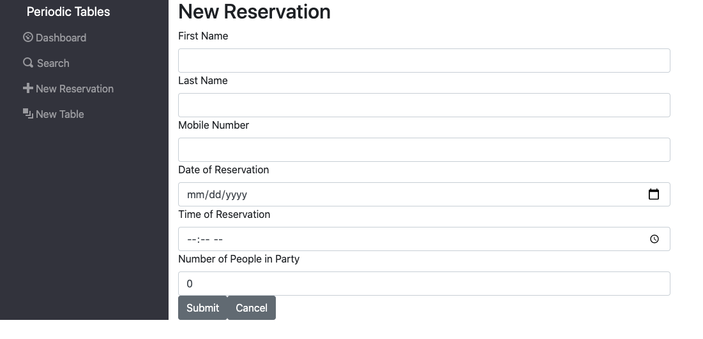
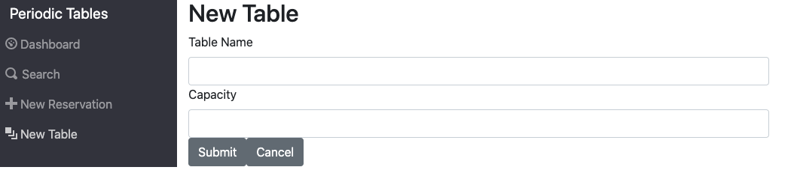
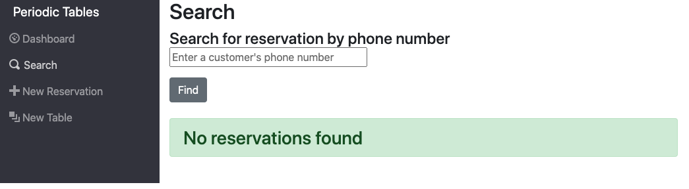

# Periodic Tables: Restaurant Reservation System

## Summary

This application was made for my capstone project for Thinkful Flex Software Engineering course. It is a reservation system and table manager to be used to track reservations as well as seat reservations to tables while updating their progress. The entire application was made to meet various user stories that the Thinkful course defined. The project's base code and assignments can be viewed on its GitHub repository [here](https://github.com/Thinkful-Ed/starter-restaurant-reservation).

## Live Application

Deployed application [here](https://starter-restaurant-reservation-eyak91zpj-mikemorter.vercel.app/dashboard).

## Technology Used

### Front-end

React, Javascript, CSS, HTML, Node,

### Back-end

Express, Knex, PostgreSQL

## Application Usage

### Dashboard

The Dashboard page lists all reservations for a particular date, and each reservation contains buttons to Seat, Edit, or Cancel the reservation. The dashboard also lists all tables and each occupied table has a finish button so the client can free up the table.

### Create a Reservation

The Create a Reservation page allows the client to create a new reservation by providing the first name, last name, mobile number, date, time, and number of people for the reservation.

### Create at Table

The Create a Table page allows the client to create a new table and assign a table name and capacity.

### Seat Reservation

The Seat Reservation page allows the client to assign a reservation to a particular table.

### Search

The Search page allows the client to search for reservations by a mobile number

## API Paths

The `./back-end` folder contains all the code for the frontend project.

The table below describes the existing files in the `./front-end` folder:

| API path                                            | Function                                                                                                            |
| --------------------------------------------------- | ------------------------------------------------------------------------------------------------------------------- |
| `/reservations`                                     | GET: List all Reservations POST: Create a new reservation                                                           |
| `/reservations/byDate?Reservation_date='YYY-MM-DD"` | GET: All reservations at a specific date (formatted YYYY-MM-DD) ordered by reservation_time                         |
| `/reservations:reservationId`                       | GET: Single reservation by Reservation_Id, PUT: Update a reservation by ReservationId, DELETE: Delete a reservation |
| `/reservations/:reservationId/status`               | PUT: UPdate a reservation status as either "Booked", "Seated", "Finished", or "Cancelled"                           |
| `/tables`                                           | GET: List all Tables POST: Create a new table                                                                       |
| `/tables/:tablesID`                                 | GET: List a single table PUT: Update a table DELETE: Delete a table                                                 |
| `/tables:tableId/seat`                              | PUT: Updates a single table's status to "Occupied" DELETE: Updates a single table's status to "Free"                |

## Installation

1. Fork and clone this repository.
1. Run `cp ./back-end/.env.sample ./back-end/.env`.
1. Update the `./back-end/.env` file with the connection URL's to your ElephantSQL database instance.
1. Run `cp ./front-end/.env.sample ./front-end/.env`.
1. You should not need to make changes to the `./front-end/.env` file unless you want to connect to a backend at a location other than `http://localhost:5000`.
1. Run `npm install` to install project dependencies.
1. Run `npm run start:dev` to start your server in development mode.

If you have trouble getting the server to run, reach out for assistance.
